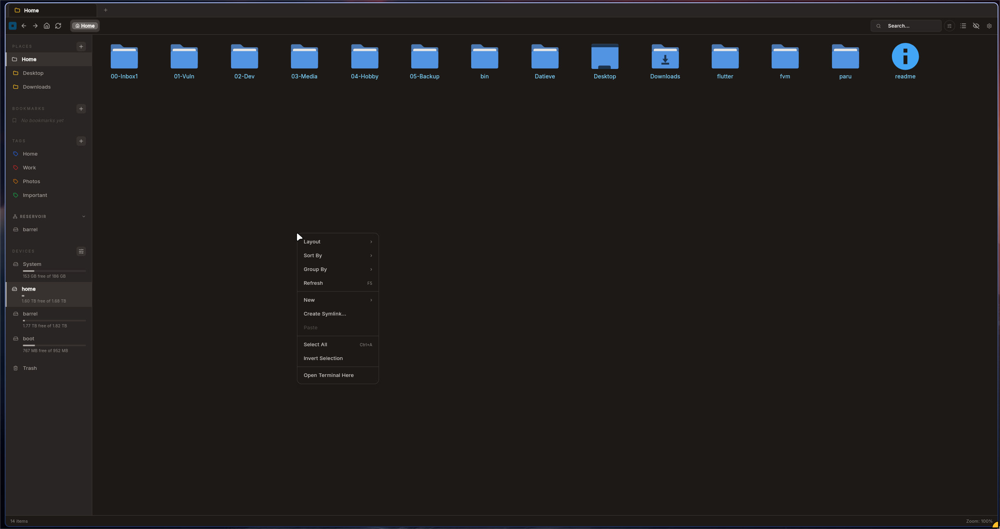
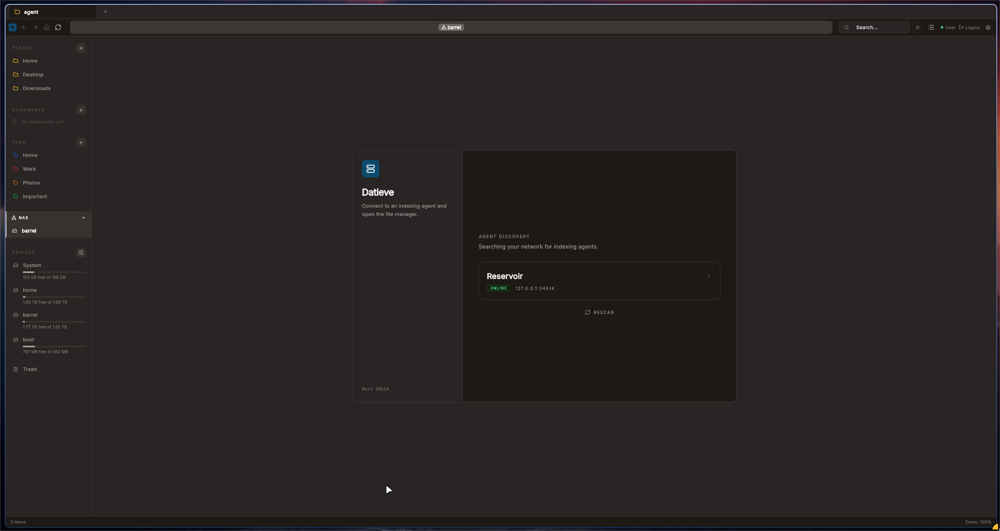
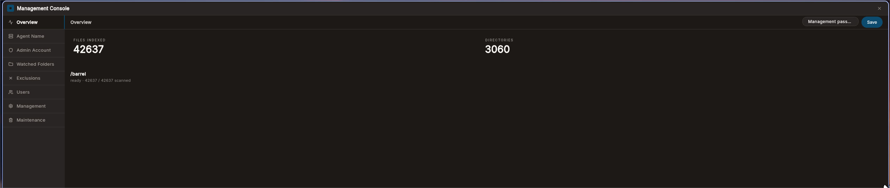

# Datieve

Datieve is a better and faster way to navigate and manager your NAS. It keeps a local database of your files so browsing and searching are instant, and it tracks deletions so you know when something disappeared and when.

---

## Screenshots

*Local file manager: compact grid view*

*Connecting to an agent on the LAN*

*Management console: 42,637 files indexed across 3,060 directories*

---

## How it works

Datieve has two parts.

**Agent:** runs on your NAS. After setup, it crawls the folders you tell it to and builds a local database of file metadata. After that it uses inotify to track file changes, with a full re-crawl every 24 hours as a fallback.

**App:** the file manager UI. Connects to the agent over LAN and lets you browse, search, and manage your NAS.

---

## Features

**Instant search and navigation:** As results come from a local database, not the filesystem, there's no waiting.
**Ghost tracking:** Deleted files are marked as deleted with the timestamp instead of being removed from the index. You can see what was deleted and when it disappeared.
**CRUD:** You can perform CRUD on your NAS files within the app natively.
**Local file manager:** It includes a full file manager for your local machine too, so you can move things between local and NAS without a second app.
**RBAC:** Create different users, and scope them to limited folders.

---

## Limitations

**No mobile:** Desktop only for now (Win/Linux/macOS).
**Not a backup:** Ghost tracking only records that a file was deleted and when. It cannot restore it.
**LAN only:** For remote access, you will need a VPN or similar setup on your end.
**Metadata only:** Datieve indexes names, paths, sizes, and timestamps. It does not index file contents.
**Not a permissions replacement:** The access controls in Datieve cover the Datieve database only. Actual file permissions on the NAS need to be managed separately.

---

## Requirements

Linux-based storage server with inotify support
~1.5 GB RAM per million directories (~10–50 million files depending on how your storage is structured)

---

## Technical Details

See [ARCHITECTURE.md](ARCHITECTURE.md).

---

## License

Apache 2.0

---

## Bugs and Feedback

I have tested the app and the agent to the best of my abilities (on Windows and Linux. macOS is not yet tested), but there may exists edge cases I may not have found. I would appreciate any bug report or feedback, and I will make sure that it gets fixed as soon as possible.

---

## Transparency

I architected this project and made all the design decisions. The implementation was done with AI assistance. The code has been reviewed and tested, but if you find something odd, please consider reporting. Bug reports are welcome.

